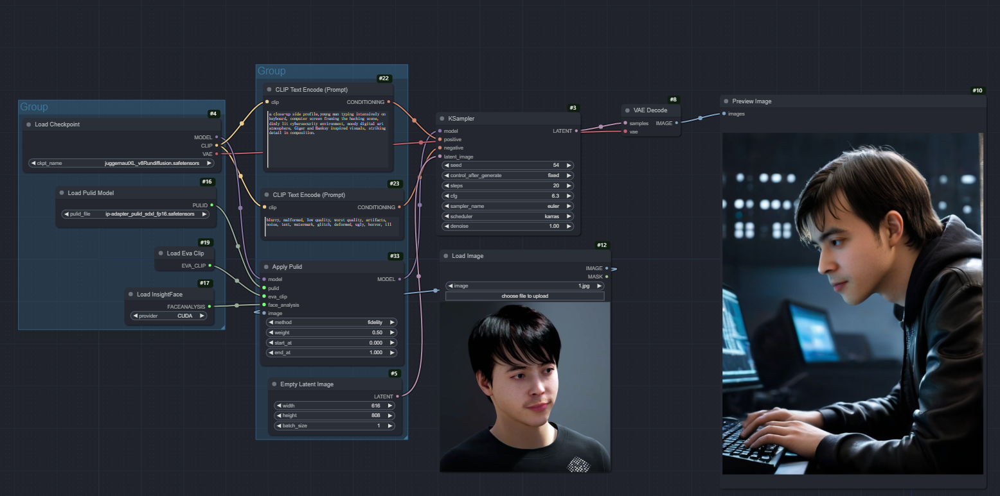

# ComfyUI-PuLID

调整自[PuLID ComfyUI](https://github.com/cubiq/PuLID_ComfyUI)，模型全部放到```models```里的目录，提前下载好，修改依赖，保证安装正常。

[PuLID](https://github.com/ToTheBeginning/PuLID) ComfyUI native implementation.




## The 'method' parameter

`method` applies the weights in different ways. `Fidelity` is closer to the reference ID, `Style` leaves more freedom to the checkpoint. Sometimes the difference is minimal. I've added `neutral` that doesn't do any normalization so the reference is very strong and you need to lower the weight.

## Installation

- [codeformer-pip]
```python_embeded\python.exe -s -m pip install codeformer-pip```

- [PuLID pre-trained model](https://huggingface.co/huchenlei/ipadapter_pulid/resolve/main/ip-adapter_pulid_sdxl_fp16.safetensors?download=true) goes in `ComfyUI/models/pulid/` (thanks to [Chenlei Hu](https://github.com/huchenlei) for converting them into IPAdapter format)


- [EVA02_CLIP_L_336_psz14_s6B.pt](https://huggingface.co/QuanSun/EVA-CLIP/tree/main)
"ComfyUI\models\pulid\QuanSun\EVA-CLIP\EVA02_CLIP_L_336_psz14_s6B.pt"

- [parsing_bisenet.pth] 
"ComfyUI\models\facedetection\parsing_bisenet.pth"

- [detection_mobilenet0.25_Final.pth]
"ComfyUI\models\facedetection\detection_mobilenet0.25_Final.pth"

- Finally you need InsightFace with [AntelopeV2](https://huggingface.co/MonsterMMORPG/tools/tree/main), the unzipped models should be placed in `ComfyUI/models/insightface/models/antelopev2`.

